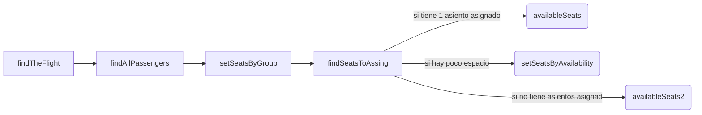
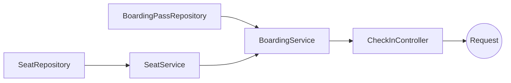

# CheckinApplication

Hola, Bienvenido a mi código.
Este repositorio es una API REST que te permite obtener los datos de aereolineas. obvio, la data es solo de prueba.
En ello declare varios End-Points, pero 1 es el más importante y por el cual esta API tiene su objetivo. a continuación, sabras como esta construida la aplicación, que tecnologías se usaron como poder ejecutar fácilmente la aplicación en tu ambiente local y de que consisten los metodos que generan la respuesta del End-Point principal. 

# Tecnologías implementadas

- Java 8
- Spring Boot 2.7.12
- Maven 4.0.0
- Docker

## End-Points

**/flights/{id}/passengers** -- Retorna una respuesta estructurada, obteniendo la información del vuelo y sus pasajeros, asignando asientos a pasajeros que no cuentan con ellos, y organizando a los pasajeros lo mas cercas de sus acompañantes, este es el End-Point más importante en la API.

se declararon los siguientes End-Points con el fin de otorgar mas opciones de peticiones de la aplicación.
**/api/**
- Airplanes
	- airplanes -- retorna todos los datos de los aviones registrados en la base
	- airplane/{airplaneId} -- retorna la información del avión por ID.
- Boarding Pass
	- boardingPassengers -- retorna todos los pases de abordar existentes en la BD
	- boardingPass/{boardingPassId} -- retorna la información de 1 pase de abordar en base al ID del pase
	- boardingPass/flight/{flightId} -- retorna una lista de pases de abordar en base al ID del vuelo
- Flights
	- flights -- retorna todos los vuelos que existen en la BD
	- flight/{flightId} -- retorna la información de 1 vuelo en base al ID del vuelo
- Passengers
	- passengers -- retorna todos los pasajeros que estan registrados en la BD
	- passenger/{passengerId} -- retorna la información de un pasajero en base al ID del pasajero
- Purchases
	- purchases -- retorna todas las compras registradas en la BD
	- purchase/{purchaseId} -- retorna una compra en base al ID de la compra
- Seats
	- seats -- retorna todos los asientos de todos los aviones registrados en la BD
	- seat/{seatId} -- retorna la información de un asiento en base al ID del asiento 
	- seatype={seatTypeId}&airplane={airplaneId} -- retorna todos los ID's de los asientos en base al tipo de asiento y el Id del avión
- Seat Types
	- seatTypes -- retorna todos los tipos de asientos registrados en la BD
	- seatType/{seatTypeId} -- retorna la información de un tipo de avión en base al ID del tipo de asiento

## Ejecución
se creo un **Dockerfile** que crea un contenedor con el entorno configurado junto con las dependencias necesarias para la ejecución de la aplicación. esto es lo que contiene el archivo:
``` 
# Utilizar una imagen base con Java 8 y Maven  
FROM maven:3.8.4-openjdk-8  
  
# Establecer el directorio de trabajo dentro del contenedor  
WORKDIR /checkin  
  
# Copiar los archivos de configuración del proyecto  
COPY pom.xml .  
COPY src ./src  
  
# Empaquetar la aplicación  
RUN mvn package -DskipTests  
  
# Exponer el puerto 8023  
EXPOSE 8023  
  
# Comando para ejecutar la aplicación al iniciar el contenedor  
CMD ["java", "-jar", "target/checkin-0.0.1-SNAPSHOT.jar"]
```
para construir la imagen ejecuta:
```docker build -t spring-boot-render .```

y para ejecutar la aplicación ejecuta:
```docker run -p 8023:8023 spring-boot-render```

## Código

A partir de este punto, todo el tema sera sobre código. como esta estructurado, el objetivo de los métodos y su función, y algunos diagramas de como es que se conectan las clases y los métodos, también se mencionara sobre las entidades especiales que se crearon para dar formato a los datos tal como se piden.
para empezar se comenzara hablando sobre:

### Entidades
En el contexto de la programación en Java, el término "entidades" se refiere a objetos que representan conceptos del dominio o del mundo real en una aplicación. Estas entidades suelen ser utilizadas en el desarrollo de aplicaciones basadas en modelos de dominio o en la implementación de sistemas que manejan datos persistentes.

para esta aplicación, fue necesario declarar las entidades de las tablas integradas en la base de datos proporcionada, y estas entidades fueron declaradas en la carpeta **models** dentro del proyecto, para crear la persistencia se uso el decorador **@Entity** antes de la declaración de la clase, también se usa el decorador **@Table** para establecer el nombre de la tabla a la que apuntara en la base de datos.
algunos de estas entidades no contienen estos decoradores para no crear una persistencia. podría decirse que son entidades que solo ayudan a presentar los datos de una forma.
a continuación se puntúan las entidades que tienen persistencia y las que son solo de presentación:
- Persistentes:
	- AirplaneEntity
	- BoardingPassEntity
	- FlightEntity
	- PassengersEntity
	- PurchaseEntity
	- SeatEntity
	- SeatTypeEntity
- DTO:
	- CheckInEntity
	- EndPointEntity
	- ManyPassengersEntity

**CheckInEntity:** es la entidad que presenta los datos del vuelo emulando la acción del check-in 
**ManyPassengers:** es la entidad que presenta la información de los pasajeros. dentro de **CheckInEntity** esta declarado una lista con esta entidad.
**EndPointEntity:** esta entidad presenta 3 datos, **status** que muestra el estatus de la petición, **data** que es una variable de tipo **CheckInEntity** y **errors** que muestra un mensaje cuando el servicio no tiene acceso a la base de datos. esta entidad es la que se muestra cuando ejecutamos el end-point **/flights/{id}/passengers**.

### Repositorios
El decorador **@Repository** se usa para marcar una clase como un componente de acceso a datos usando la arquitectura de persistencia de **Spring Data JPA**, estas clases actúan como interfaces del repositorio,  y define la abstracción de acceso a datos de forma especifica.
en ella podemos definir funciones que pueden permitirnos hacer las acciones CRUD (Create, Read, Update, Delete). explicándolo de una forma más resumida, esto nos permitirá definir ciertas operaciones, operaciones que serán la interacción con **Java** y **MySQL**.

¿Porque se esta explicando esto, si esto es parte de la documentación del framework?

para esta aplicación, se definieron varios "querys" que permitieron facilitar la obtención de datos especifica para las operaciones requeridas, estas están definidas en **BoardingRepository** y **SeatRepository** ubicadas en la carpeta **repositories** dentro del proyecto. 
En esta carpeta, están ubicados mas archivos que permiten la comunicación entre la persistencia de la obtención y manipulación de datos, vera que en algunos no tienen declarado ningún método, esto porque con la implementación de **CrudRepository** que nos trae métodos ya establecidos por la paquetera importada, y solo es necesario escribir los métodos personalizados necesarios.
Dentro de las interfaces anteriormente mencionadas están los siguientes métodos con la siguiente función y con el query definido:

- BoardingRepository:
	- **findByFlightId:** este método retorna una lista de pases de abordar filtrados por el ID de vuelo, esto para obtener los pases de abordar del vuelo en cuestion, y con la lista poder procesar los pasajeros y su demas información. 
		- Query: 
			 ```select bp from BoardingPassEntity bp join bp.flight f where f.flightId=:flightId```

	- **findIfTheSeatIsFree:** este método retorna un objeto de tipo **SeatEntity** este método se declaro con la finalidad de determinar si el asiento esta disponible o ya esta ocupado por algún pasajero. 
		- Query:
			```select bp.seat from BoardingPassEntity bp join bp.seat s join bp.flight f where s.seatId=:seatId and f.flightId=:flightId```

- SeatRepository:
	- **findSeatByColumnAndRow:** este método retorna un entero, se definió con el fin de obtener el ID del asiento buscado en base a la columna y el renglón.
		- Query:
			```select s.seatId from SeatEntity s join s.airplane a where s.seatColumn=:seatColumn and s.seatRow=:seatRow and a.airplaneId=:airplaneId```
	- **allSeatsForType:** este método retorna una lista con todos los asientos en base al tipo de asiento y el avión. este método se definio con el fin de obtener los ID's de los asientos del avión ordenados por columnas, usando esto en una iteración que permita movernos de forma vertical por las columnas  de los asientos. ejemplo: A9,B9,C9,... A30,B30,C30.
		- Query:
			```SELECT s.seatId FROM SeatEntity s JOIN s.seatType st JOIN s.airplane ai WHERE st.seatTypeId=:seatTypeId AND ai.airplaneId=:airplaneId ORDER BY s.seatRow ASC, s.seatColumn ASC```

### Servicios
Un componente de servicio es una clase que contiene la lógica de negocio de una aplicación y proporciona servicios específicos a otras partes del sistema.

`Aquí es donde esta prácticamente toda la magia B) `

Cada entidad tiene su propia clase de servicios donde se definieron los métodos que generan la respuesta de los End-Points antes mencionados. donde se estableció la lógica que construye la respuesta del End-Point principal esta en la carpeta **services** en **BoardingPassServices.** cabe mencionar, que los métodos definidos anteriormente se definieron en una Interface, estos métodos se delegaron a su **service** respectivo, esto para poderlos consumir dentro de los demás service. que solo es el caso de **SeatService**, y en **BoardingPassService** se definen también, pero, la ventaja es que están definidos dentro de la clase que usaremos para generar la respuesta.

a continuación te describiré los atributos y métodos que forman parte de este servicio y cual es su función:
#### Declaraciones Globales
- boardingPassRepository  -- este atributo permite delegar las interfaces del repositorio
- seatService -- este atributo permite delegar las interfaces del servicio de SeatServices
- seatsNotAvailable -- es una lista que coleccionara los ID's de los asientos que ya no estan disponibles para ocupar, este con el fin de identificar si un asiento se encuentra ocupado y optimizar el algoritmo.
- checkIn -- es un objeto de tipo CheckInEntity donde mapearemos los datos para la respuesta del End-Point.
#### Métodos
- findIfTheSeatIsFree [Boolean] -- este metodo busca si hay un asiento disponible buscando en los pases de abordar, si hay un pase al cual no ha sido asignado un asiento, esta disponible y retornara un True.
- availableSeats [List< Integer >] -- este método retorna una Lista con los ID's de asientos disponibles, recibe las variables **seat**, **passNotSet** y **airplaneId**. **seat** es para obtener varias propiedades del asiento asignado de 1 pase de abordar con varios asientos sin asignar, **passNotSet** es el contador de asientos no asignados dentro del grupo, y **airplaneId** es para identificar el avión del que se esta procesando el pase. este método esta dedicado para los pasajeros que ya tienen un asiento y en base a ese asiento asignar los asientos mas cercanos en base al grupo de lineas que corresponda.
- availableSeats**2** [List< Integer >] -- hay casos en que un grupo de pasajeros de un pase de abordar, ninguno tiene asignado un asiento, este método recibe **seatTypeId**, **passNotSet** y **airplaneId**, dentro del método se usa el primero para determinar de que tipo de asientos compraron, el segundo para saber cuantos asientos se necesitan asignar y el tercero para saber que avión van a abordar. este método retorna una lista de IDs con los asientos disponibles y la cantidad de asientos disponibles para los pasajeros. este método esta dedicado a asignar los asientos a pasajeros que no tienen asignado ningún asiento en su pase de abordar
- setSeatsByAvailability[List< Integer >] -- este método asigna pasajeros por disponibilidad de asientos, hay ocaciones en que las filas ya están mayormente ocupadas, con el atributo **seatsNotAvailable** y una variable local declarada como **siast** que contiene la respuesta del método **allSeatsForType** se filtran cuales son los asientos mas posiblemente continuos disponibles para los pasajeros sin asiento asignado en el pase de abordar. este método recibe **seatTypeId**, **passNotSet** y **airplaneId**.
- findSeatToAssign [List< ManyPassengersEntity >] -- este método que determina como serán buscados y asignados los asientos al grupo de pasajeros agrupados por pase de abordar, el método recibe **groupPassengers** y **airplaneId**, este método busca si el grupo tiene algún pasajero con algún asiento ya asignado y define cuantos asientos hacen falta asignar, y como resultado retorna el mismo grupo de pasajeros que recibió pero con los asientos ya asignados.
- setSeatsByGroup [List< ManyPassengersEntity >] -- este método separa las agrupaciones de pasajeros en base al pase de abordar, si el pase de abordar esta relacionado al mismo id de pase, se coleccionan en un grupo y se envía al método **findSeatToAssign** que recibe como respuesta la misma lista de grupos con asientos asignados y esta lista la agrega a una sola lista declarada **passGroupWithSeat**, separando así el id de los pasajeros que tengan asiento asignado, así, con ese ID de pasajero partir con la asignación consecutiva de asientos
- findAllPassengers [List< ManyPassengersEntity >] -- este método es donde se obtienen todos los pasajeros que son parte del vuelo y se coleccionan en una lista para enviarlos a **setSeatsByGroup** para agruparlos por el ID de compra, en este método también se ordena la lista por el ID de compra con el método **sort** que es parte de la paquetera de java.util.List.
- findTheFlight [CheckInEntity] -- Este método obtiene de la entidad **BoardingPassEntity** todos los pases de abordar en base al ID de vuelo, con esta información, toma el primero y se obtiene *flightId*, *TakeoffDateTime*, *TakeoffAirport*, *LandingDateTime*, *LandingAirport*, *AirlineId* y *Passengers*, al asignar *Passengers*, se manda llamar al método *findAllPassengers* para comenzar a procesar todos los pasajeros que tienen relación con el vuelo y poder asignarle a los pasajeros que no tienen asiento, su lugar.
- checkIn [CheckInEntity] -- este método manda a llamar a findTheFlight cuando se solicita la respuesta con el End-Point.

Básicamente la estructura del proceso es así: 


### Controladores
un controlador especializado en la creación de servicios web RESTful.
estos controladores estan ubicados en la carpeta **controllers** dentro del proyecto, en estas clases estan definidos los distintos End-Points y claro el End-Point principal que es **/flights/{id}/passengers**, este esta declarado en **CheckInController**, es el único declarado en la clase, aqui la unica logica que esta implementada en el método es para formatear la respuesta con un EndPointEntity y dependiendo de la respuesta http asigna el código dentro de la respuesta junto con el dato ya transformado.

aqui se muestra el resumen del árbol de procesos que realiza esta app para generar la respuesta:



### Ultimo Punto.
Al realizar el desarrollo el Script proporcionado para generar la base de datos de forma local, esto para tener mas agil el trabajo y no tener problemas con conexiones. al realizar pruebas de "producción" se observo que el servidor tiene un tiempo de respuesta algo prolongado. esto hacia que la petición tardara en realizarse, probablemente sea por la distancia a la que esta el servidor o por la cantidad de peticiones que se estaba realizando, de todos modos para esto, en el archivo **application.yml** se le asigno un *lifetime* a la aplicación con un tiempo de 5 segundos, ya que en el enunciado se menciona que ```El servidor está configurado para que todas aquellas conexiones inactivas por más de 5 segundos
sean abortadas, por lo que se requiere controlar la reconexión.```

Agradezco la oportunidad de postular, y la experiencia de realizar este proyecto, disfrute mucho realizarlo.
Saludos!
